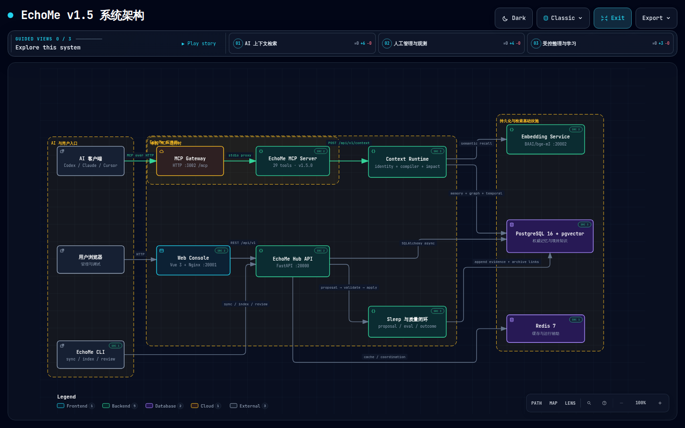

# EchoMe

> 让每个 AI，都能接住你的过去。
>
> Switch AI, not yourself.

[](https://pypi.org/project/echome/)
[](https://pypi.org/project/echome/)
[](https://github.com/qzhqzh/EchoMe/actions/workflows/ci.yml)
[](LICENSE)

EchoMe 是一个面向 AI Agent 的**个人记忆与项目上下文层**。它统一保存工作习惯、技术偏好、项目文档、约束关系、历史决策和验证证据，让 Codex、Claude Code、Cursor 等客户端通过 MCP 获得一致、可追溯、可演进的上下文。

当前稳定版本为 **v1.5.0**，主题是 Reliable Context Runtime。

## 核心架构

<a href="https://qzhqzh.github.io/EchoMe/?theme=dark&amp;present=1">
  
</a>

> 点击架构图进入[交互式版本](https://qzhqzh.github.io/EchoMe/?theme=dark&present=1)。默认使用 **Dark + Presentation Stage**，支持节点搜索、关系追踪、缩放、主题切换和图片导出。

架构图由 [Archify 规格](docs/echome-architecture-v1.5.archify.json) 生成，独立 HTML 保存在 [docs/echome-architecture-v1.5.html](docs/echome-architecture-v1.5.html)。

## 核心能力

### 统一上下文入口

AI 默认调用 `echome_context`，由运行时自动完成：

- personal / project / impact / temporal 路由选择
- canonical project 与 alias 解析
- 记忆、约束、制品、事件和图关系召回
- 冲突、未知项、时效性和 answerability 判断
- token budget 控制与检索 trace 记录
- Hub 不可达时的加密、只读 last-known-good 降级

模型不需要先猜测应该使用记忆搜索、图查询还是项目上下文工具。

### 个人记忆

- 三轴模型：`Type × Scope × Layer`
- `L0` 全局加载、`L1` 项目加载、`L2` MCP 按需检索
- keyword、vector、graph、temporal 多种检索证据
- `active / ai_review / pending / deprecated / archived` 状态管理
- `derived_from`、`superseded_by` 等可追溯关系
- feedback、temporal review 和检索质量评估

### Project Knowledge

- 项目制品版本与 chunk 索引
- 版本化约束、关系边和来源证据
- Project Events 记录 issue、failure、fix、test、decision 和 deploy
- Context Compiler 按任务与改动路径生成证据优先的上下文包
- Impact 与 Preflight 在修改、测试、提交和部署前提供历史约束
- canonical project aliases 避免目录名、Git remote 和历史 ID 分裂上下文

### Memory Sleep

Memory Sleep 用于整理不断增长的记忆，但不会静默覆盖历史：

1. Hub 返回所有符合条件的非归档、非 deprecated 候选。
2. 服务端或能力更强的客户端 AI 生成文本预案和 `memory_sleep_plan.v1` JSON。
3. Hub 校验并展示 proposal。
4. 确认后新增归纳记忆，原记忆转为 archived，并保留派生和替代关系。

### 质量与可观测性

Web Console 提供：

- Memory 与 Project 工作台
- 可交互记忆关系图和节点邻居
- Retrieval Debugger 与检索日志
- Context Runs、fallback、错误与选入证据
- Memory Quality Eval 与 Project Context Eval
- Sleep session 和变更审计

Context Outcome 与 Memory Feedback 均为 append-only 信号，不会直接、静默地改变生产排序。

## AI 应该如何使用 EchoMe

推荐工作流：

1. 首次接触时调用 `echome_capabilities` 发现能力。
2. 普通任务优先调用 `echome_context`。
3. 宽泛记忆问题使用 `echome_search_summary`，再按 UUID 调用 `echome_get_memories` 精读。
4. 关键历史决策调用 `echome_memory_explain` 检查来源、替代关系和时效性。
5. 项目修改前调用 `echome_project_preflight`，需要局部影响分析时调用 `echome_project_impact`。
6. 任务结束后，仅在证据明确时追加 feedback、event 或 context outcome。

EchoMe MCP 当前提供 `core` 和 `full` 两种 profile。默认 `full` 暴露完整工具集，`ECHOME_MCP_PROFILE=core` 只保留统一上下文、健康检查、remember、outcome 和 feedback 等核心入口。

## 系统组件

| 组件 | 技术 | 作用 |
|---|---|---|
| Hub | FastAPI + SQLAlchemy 2.0 + Alembic | 权威 API、身份解析、上下文编译与审计 |
| PostgreSQL | PostgreSQL 16 + pgvector | 记忆、项目知识、向量、关系和运行证据 |
| Embedding | BAAI/bge-m3 | 语义向量生成与召回 |
| Web Console | Vue 3 + Nginx | 管理、观测、图分析和质量评估 |
| CLI | Typer + Rich + httpx | 初始化、同步、审核、Sleep 与环境诊断 |
| MCP Server | 官方 Python MCP SDK | 向 Codex、Claude Code、Cursor 等暴露 29 个工具 |

默认 Docker Compose 端口：

| 服务 | 地址 |
|---|---|
| Hub | `http://localhost:20000` |
| Web Console | `http://localhost:20001` |
| Embedding | `http://localhost:20002` |

## 安装

要求 Python 3.11 或更高版本。

```bash
pip install --upgrade echome
echome version
```

也可以直接从 GitHub 安装：

```bash
pip install "echome @ git+https://github.com/qzhqzh/EchoMe.git"
```

## 快速开始

### 1. 部署 Hub

```bash
git clone https://github.com/qzhqzh/EchoMe.git
cd EchoMe
cp hub/.env.example hub/.env
docker compose up -d
```

启动后访问 `http://localhost:20001` 使用 Web Console。

### 2. 初始化 CLI 与 MCP

```bash
echome init
echome doctor
```

`echome init` 会创建本地 vault、配置 Hub，并注册可识别的 AI 客户端。也可以单独执行：

```bash
echome mcp install
```

MCP Server 默认使用 stdio：

```bash
echome mcp serve
```

需要本地 Streamable HTTP 时：

```bash
echome mcp serve --http --host 127.0.0.1 --port 20003
```

### 3. 添加和同步记忆

```bash
echome add
echome list
echome search "Git 提交流程"
echome sync
```

### 4. 整理记忆

```bash
echome sleep candidates
```

Sleep apply 需要先提交并确认合法 JSON 预案，不会直接批量重写原始记忆。

## 常用命令

| 命令 | 说明 |
|---|---|
| `echome init` | 初始化 vault、Hub 和 MCP |
| `echome add` | 添加记忆 |
| `echome list` | 查看记忆 |
| `echome search` | 搜索记忆 |
| `echome sync` | 渲染并注入 L0/L1 记忆 |
| `echome review` | 审核 AI 写入的 `ai_review` 记忆 |
| `echome sleep` | 生成、提交和执行 Memory Sleep 预案 |
| `echome doctor` | 检查版本、配置、Hub 与 MCP |
| `echome status` | 查看运行和同步状态 |
| `echome mcp install` | 注册 MCP Server |

## 数据安全原则

- PostgreSQL + pgvector 是唯一权威服务端数据层。
- 数据库迁移采用 Alembic；v1.5 当前 schema revision 为 `015`。
- archived 和 deprecated 记忆不会作为当前有效事实参与默认检索。
- Sleep、项目重关联和约束复核采用 `proposal → validate → apply`。
- 原始记忆、制品版本、约束版本、事件和关系证据不被静默删除。
- 运行反馈先追加记录，经过离线评估后才考虑影响排序。
- 本地 last-known-good 缓存使用 AES-256-GCM 加密，并受账号、请求键和 TTL 约束。

## 开发与验证

```bash
# CLI + MCP
uv sync --extra dev
uv run pytest
uv run ruff check echome echome_mcp tests

# Hub
cd hub
uv sync --extra dev
uv run pytest
uv run ruff check app tests alembic/versions

# Web
cd ../web
npm install
npm run build
```

v1.5.0 发布验收基线：

- Hub：`96 passed, 1 skipped`
- CLI/MCP：`21 passed`
- Ruff 与 Web production build 通过
- 隔离生产数据完成 `012 → 015 → 012 → 015` 数据保留型迁移验证

## 文档

- [系统架构](docs/architecture.md)
- [v1.5 规划与验收](docs/next-version-plan-v1.5.md)
- [记忆模型](docs/memory-model.md)
- [记忆检索设计](docs/memory-retrieval.md)
- [Memory Sleep](docs/memory-sleep.md)
- [Hub API 规范](docs/api-spec.md)
- [MCP Server 规范](docs/mcp-spec.md)
- [开发路线图](docs/roadmap.md)
- [用户指南](docs/user-guide.md)

## License

[MIT](LICENSE)
