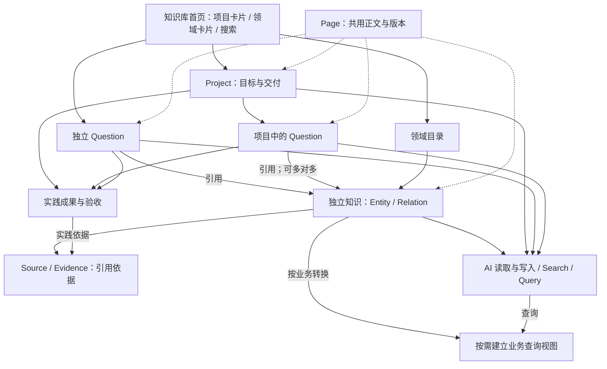
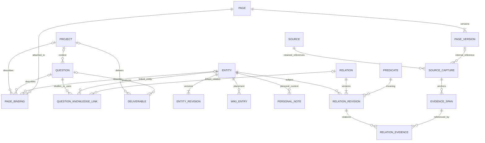

# EchoMe 知识库架构草案

草案版本：0.6。讨论与首版实施日期：2026-10-06。

EchoMe 新知识库从空库建立，主要工作流从项目或独立问题出发：明确目标，研究问题，收集或形成知识，实践验证，交付真实成果，再供后续项目复用。知识库首页提供项目卡片与知识领域卡片两种视图。Page 是跨对象的正文编辑与展示能力，承载项目说明、问题研究和知识介绍。特定业务仍可按需构建查询数据；旧记忆的选择性抽取安排在新体系建立之后。

知识在用户授权范围内独立保存，项目与问题通过多对多引用使用它。工作从项目或问题开始，不改变知识的独立身份、生命周期和检索入口。

本文保留讨论阶段的逻辑设计。用户已授权推进首版；实际表、字段、接口、权限与已验证范围见 [首版实施契约](knowledge-workbench.md)。源码共用版本化对象表，将以下逻辑职责映射为严格的类型化字段；本地实现不代表生产现状。

## 已确认原则

1. 日常工作主要从 Project 中的问题或独立 Question 出发，再收集与形成知识。Project、Question、Page 首版提供；数据创建仍保持可选关联，允许独立问题和直接创建知识，不要求人为补齐全套对象。
2. AI 默认复用现有知识，非必要时保持较粗粒度。用户明确要求，或者 AI 判断细分会改变含义、关系、适用条件或实际使用时，可以拆分；粗粒度不构成永久限制。
3. 外部系统需要快速、准确地查询知识。允许为具体领域、系统和业务进行二次结构化，建立专用关系数据与查询服务。
4. Wiki 的领域划分可在使用中调整，经验关联可为空，未来可以增加网状视图。
5. 新知识体系可以独立建立。旧记忆中只有部分内容适合提炼为实体或关系，后续按需抽取，不以整体转换旧记忆作为建设前提。
6. 外部资料默认登记链接或出处，按需保留必要摘录；不默认保存全部原文。自己编写的 Page 则需要保存完整正文。
7. 知识库菜单默认展示多个项目的卡片平铺视图，可以切换为知识领域卡片视图，并提供快速搜索。进入详情后逐步展开问题、正文、知识、来源和成果。
8. Page 是项目、问题、领域及知识点共用的内容载体和表现形式。它有持久化正文与版本，归属横向内容能力，不单列业务层级。
9. 首个案例以“AI 构建 3D 鲸鱼娘”项目及“AI 如何构建 Blender 建模？”问题展开，验收应包含实际成果、可复现过程与复用知识。模型风格、质量要求和最终文件清单尚待具体化；当前文档不代表已有成果。
10. 实际任务由用户现有 AI / Blender 环境执行，EchoMe 管理知识、研究进展与成果。AI 通过 API / MCP 读取上下文并回写记录；首版页面中的状态表示已保存的研究或交付状态，页面内启动与调度建模任务不在首版范围内。
11. 知识与项目分开。一个知识点或关系可以服务多个问题和项目，也可以尚未被任何项目使用；项目和问题不拥有知识记录。
12. 相似、冲突、过度泛化及粒度膨胀等问题由 AI 与人协作处理，结合逐张刷卡、可解释的风险提示和人工判断。具体风险分级、动作权限和审核字段见本轮拟议设计。

## 总体架构

产品工作流以项目和问题组织，技术职责分成以下四块。Page 横向服务多个业务对象，界面按用户的工作入口组合这些能力。

| 职责 | 保存什么 | 具体操作 |
|---|---|---|
| 1 项目与问题 | Project 目标与状态、Question、知识引用、成果及验收记录 | 提出问题、研究与实践、形成结论、交付成果 |
| 2 知识 | Entity 实体、Relation 关系及条件；领域目录与个人认知备注 | 从问题中收集和整理可复用知识，跨项目使用 |
| 3 来源与证据 | Source 出处、Evidence 定位与必要摘录；原文快照可选 | 给结论添加出处，定位外部材料、Page 版本或实践结果 |
| 4 查询服务 | 通用读取接口；按业务需要建立的查询视图或专用表 | 搜索候选、按条件枚举知识、向外部系统提供业务查询 |

Page 为 Project、Question、Entity 提供统一的正文、图片与资源引用、内部链接和版本历史。领域用 topic 类型的 Entity 表示，因此也能使用 Page。项目卡片读取项目记录，领域卡片读取独立知识目录，两者通过引用连接。知识目录与知识关系网共用实体身份；业务查询结果可以重建。

初期这些模块运行在现有 Hub 与 PostgreSQL 中。业务视图按需求建立，不要求基础知识从创建之日起满足所有业务字段。跨项目复用仍受用户权限限制；它不等于公开共享。

基础知识负责实体身份、当前陈述、原始描述及来源；业务视图负责该业务需要的类型、单位、条件字段、准入规则和索引。视图转换过程中产生的业务专用细节可以留在视图中。具有通用复用价值的结论，可再通过正常知识写入流程收录。

下图表示主要记录关系。Source 是出处登记，Source Capture 是一次不可覆盖的引用留存记录，内容可以仅为出处元数据；它不代表已经归档全文。绑定表的目标选择约束及完整外键在实施规格中落实。

关系的实体客体同样引用 ENTITY；标量客体保存在关系版本中。目录父子关系为 WIKI_ENTRY 的可空自引用，关系图显示时不将其自动解释为事实推理关系。

## 知识独立与复用的规则

以下区分工作记录与知识记录的归属，首版即落实：

1. Entity、Relation 不设置“所属项目”或“所属问题”字段。它们通过 user_id 确定权限边界，具有独立 ID、版本和归档状态，可以从领域、搜索或 API 直接访问。
2. Project 组织工作，Question 表达具体问题。问题引用知识采用独立的多对多关联记录；来源可以记录知识最初在哪次研究中形成，这条溯源信息不构成项目所有权。
3. 同一知识点被多个问题使用时，引用同一个 ID。项目移除引用、结束或归档，都不级联删除共享知识及其必要的证据记录。
4. 知识正文写可复用的概念、方法、条件与限制；某个问题为什么采用它、具体参数、实际结果与局部调整，保存在该问题的引用说明和研究 Page。确有普遍复用价值的发现，再修订共享知识或新增带条件的陈述。
5. 日常查阅默认显示最新知识；记录实际使用或已交付案例时固定当时的知识版本，若方法来自知识 Page，还固定 Page 版本。知识后续修订可以提示复核，历史案例继续指向当时实际依据，不被静默改写。
6. 项目“相关知识”由项目直接引用与下属问题的引用汇总、去重得到，不再人工维护一份知识正文或第二份问题引用清单。解除某个项目直接引用，不影响其下属问题仍在使用的引用。

两种关联分开处理：Entity → Relation → Entity/值表达知识含义；Question → 知识引用表达某次工作对知识的需要或使用。后者不自动变成领域知识关系。独立保存仍可使用同一 Hub 和 PostgreSQL，无需据此拆分部署。

## 核心边界

| 问题 | 拟议规则 |
|---|---|
| 来源、结论和视图哪一份负责什么 | 出处登记与保留片段记录引用依据；Page 版本记录自己当时写了什么；实体与关系记录当前知识表达；业务视图保存可重建的查询结果 |
| 知识缺少证据能否保存 | 可以。来源与核实情况明确显示；具体业务决定哪些记录可以进入其查询结果 |
| AI 是否能创建和细分知识 | 可以。先查已有实体，复用名称及别名；记录原因并检查版本；合并、改写已核对结论及影响既有引用的重组按风险审核规则生成待确认变更 |
| 目录是否决定知识语义 | 目录位置只负责导航；分类关系、组成关系及事实陈述用明确的关系表示 |
| 修改业务视图能否直接改知识 | 纠错通过修订基础知识或版本化转换规则完成，然后重新构建视图 |
| Page 与来源如何存储 | Page 为项目、问题和知识点提供正文及版本；引用 Page 作证据时，Source 指向已有 Page，引用记录固定到 Page 版本，不再复制一份可编辑正文 |
| 个人认知放哪里 | 个人备注与实体关联，详细实践可以写成 Page；旧记忆关联后续接入。记录数量不自动换算为掌握程度 |
| 项目中的知识是否属于该项目 | 项目和问题保存引用，实体与关系保持共享身份；项目归档不删除共享知识 |
| 问题解决是否等于项目交付 | 问题结论与项目交付分别记录。项目交付需要实际成果及对应验收结果，知识条目数量不充当交付进度 |
| Page 内的文字是否自动成为知识关系 | 正文先完整保留；需要复用或查询的结论再显式提炼并引用来源。页面内部链接只表示引用，不自行生成事实关系 |
| AI 预警是否等于内容已被判错 | 预警记录疑点、依据和建议；是否错误、如何改正及是否停用分别记录。相似度、AI 置信表达和“有用”反馈都不能代替事实核对 |

内部 Page 修订后，引用其旧版本的结论可以标记需要复核。外部资料只有重新访问并观察到变化后才能提示复核；仅保存链接不能自动感知网页变化，也不能恢复当时未保留的原文。变化本身不自动推翻旧结论。

## 用户实际操作的界面

| 界面 | 展示与操作 | 对应记录 |
|---|---|---|
| 知识库首页：项目视图（默认） | 多项目卡片平铺；卡片显示名称、简短说明、状态、最近更新，可选封面与待解决问题数 | 已启用知识工作区的 Project；不复制现有项目身份 |
| 知识库首页：领域视图 | 大领域卡片平铺，进入后看简介、小领域与知识点；可回到相关项目 | 目录位置、topic 实体及 Page |
| 项目详情 | 默认打开总览 Page；就近切换问题、相关知识、补充页面、成果与验收 | Project、Page 绑定、Question、知识引用与 Deliverable |
| 问题详情 | 问题背景、当前研究与回答使用 Page；关联待研究/已使用知识、资料、实践记录与结果 | Question、Page、带角色的知识引用、Source、Deliverable |
| 知识详情 | 知识正文使用 Page；分区展开关系、个人认知、来源，以及使用过它的问题、项目和案例 | Entity、Relation、Page、个人备注与反向引用 |
| 关系网 | 从某个节点展开关联，按关系类型过滤，点击回到同一详情页 | 同一套 Entity 与 Relation；目录边单独标明 |
| 来源面板 | 原始链接或文件位置、引用段落、保留范围、访问日期 | Source、引用留存记录、Evidence；全文仅在确实保留时展示 |
| 待核对列表与刷卡 | 展示疑似重复、冲突、泛化、正文不一致等具体事项；逐项比较、补查、作出决定 | 关联具体内容版本的审核事项、修改建议与判断记录；不复制知识为新卡片 |
| 业务查询管理页 | 某个业务需要哪些字段、覆盖哪些内容、何时构建、有哪些缺口 | 查询定义、构建记录与派生结果；首个消费者确定后再开发 |

首页保留“新建项目”“提出问题”两个明确入口。独立问题有可见的列表入口，也能通过搜索直达；不强制放入虚构项目。首页视图切换可记住用户选择，初次默认项目视图。

快速搜索统一覆盖项目、问题、领域、知识点、Page 与已保存来源信息，按类型分组展示匹配原因及归属。位于项目详情时可以选择“本项目”或“全部知识库”；本项目范围包括它明确引用的共享知识。搜索到项目或实体的总览正文时，默认打开对应对象详情及命中位置，避免把同一对象和它的总览 Page 显示成两个相同结果；补充 Page 可独立显示。

知识点详情显示一个丰富的正文页面；侧栏或下方按需展开结构化关系、来源与相关案例。独立的“Page 管理”不作为首页主入口。领域可以只有名称，无正文或经验；用户写入正文时系统自动保存 Page，无需先手动新建文档再绑定。

项目与领域两种入口可互相回溯：项目 → 问题 → 使用的知识 → 所属领域；领域 → 知识 → 研究/使用过它的问题 → 实际项目和成果。问题、项目、交付物属于工作记录，首版不自动转换为知识实体，也不把每段正文变成图节点。

## 字段约定

以下为逻辑字段草案。字段表中的必填指 API 请求要求；身份、时间、版本及默认值由服务端补齐。最终 SQL DDL 需按选定模块落实外键、索引和迁移，不能把跨类型 ID 字符串直接视作已校验的引用。

- 新增知识记录使用 UUID；复用现有 Project 身份时沿用其 `VARCHAR(128)` ID。所有私有记录带服务端确定的 `user_id VARCHAR(64)`，沿用现有 Hub 身份边界。
- 可编辑记录带 `revision INTEGER`、`created_at TIMESTAMPTZ`、`updated_at TIMESTAMPTZ`，首次 revision 为 1。
- 实体和关系的主记录保留稳定 ID 与 `current_revision_id`；正文、状态及其他可编辑字段写入不可变的 `entity_revisions`、`relation_revisions`。读 API 展开当前版本，历史引用使用具体 revision ID。
- 版本表包含 `id`、所属记录 ID、`user_id`、`revision`、对应字段快照、`change_reason`、操作者与创建时间；同一记录的 revision 唯一。创建首个版本和切换当前版本在同一事务内完成。
- 修改请求携带 `expected_revision`；版本不符返回 409，并保留当前记录。
- `created_via`、`updated_via` 记录 `human / ai / import / system`；实际操作者由认证信息确定。
- 实体、关系和个人备注的修订保留历史。关系历史必须能够被证据和业务结果按版本引用。
- 普通删除采用归档。名称和目录路径不充当外部系统的稳定标识。

外键与查询同时带用户边界校验；实体、关系、证据、目录和来源引用不能借不同用户的 ID 串接。内部表优先以复合外键约束同用户关联，服务层仍做授权检查。关系客体的二选一、时间范围顺序、版本号唯一及目录无环分别使用数据库约束或事务内检查落实。常用列表索引以 user_id 开头，再按实体、关系类型或父目录组织。

## 实体字段

`knowledge_entities` 表示讨论对象。名称、别名和短摘要用于识别与卡片；详细介绍使用关联的总览 Page。领域节点使用 topic 类型，无需另建一套领域正文。

| 字段 | 类型与默认值 | 请求要求与含义 |
|---|---|---|
| `name` | VARCHAR(256) | 必填，去除首尾空白后非空 |
| `kind` | VARCHAR(32)，默认 `concept` | 可选；初期可提供 topic、concept、tool、method、object 等建议值 |
| `summary` | TEXT，默认空 | 可选，保存卡片及搜索用短摘要；丰富正文存于总览 Page |
| `overview_page_id` | UUID，可空；API 展开字段 | 从 Page 绑定读取，不再单独维护第二份归属关系 |
| `aliases` | JSONB 字符串数组，默认空数组 | 可选，辅助查找与消歧 |
| `attributes` | JSONB 对象，默认空对象 | 可选，保留扩展描述；需要独立证据的结论使用关系记录 |
| `status` | VARCHAR(16)，默认 `active` | active、archived、merged |
| `merged_into_id` | UUID，可空 | 合并后指向保留的实体，旧 ID 仍可解析 |

名称不在全库强制唯一。相同词语可能指不同对象；名称或向量相似只是复用候选，不能独立构成自动合并的依据。

## 关系字段

`knowledge_relations` 保存实体之间的联系，或者实体的一个可独立修订的陈述。以下字段描述当前版本；修订同时保留不可变的 `relation_revision_id`。

| 字段 | 类型与默认值 | 请求要求与含义 |
|---|---|---|
| `subject_id` | UUID | 必填，主体实体 |
| `predicate_id` | UUID | 必填，引用关系类型 |
| `object_entity_id` | UUID，可空 | 客体实体；与 `object_value` 必须且只能提供一个 |
| `object_value` | JSONB，可空 | 有类型的标量，如 `{"type":"number","value":3}`；避免为数值和日期创建实体 |
| `statement_md` | TEXT，默认空 | 可选，保留便于阅读的完整陈述 |
| `qualifiers` | JSONB 对象，默认空对象 | 可选，表达环境、版本、适用条件、单位等 |
| `perspective` | VARCHAR(16)，默认 `unspecified` | general、personal、unspecified；描述结论范围，不代表真实性或公开权限 |
| `status` | VARCHAR(16)，默认 `active` | active、archived，表示是否参与当前使用 |
| `review_state` | 服务端维护的状态，默认 `unreviewed` | unreviewed、reviewed、disputed；按内容版本及有效判断记录返回，不能由普通写入自行声明已经人工核对 |
| `valid_from`、`valid_to` | TIMESTAMPTZ，可空 | 可选，描述已知的时间适用范围 |

active 可以同时为 unreviewed。通用搜索可展示它并携带状态；专用业务视图按自己的规则筛选。reviewed 表示针对所指版本及范围做过核对，需有判断记录；“有用”反馈不将其置为 reviewed。核对者、依据和未决风险分别返回，核对不构成绝对正确的保证。

核对记录与内容版本分开保存；审核状态可按引用该版本的有效判断派生或缓存。人工接受具体修改时，决定同时记录修改前的目标版本和实际生成的新版本。后续内容修订默认重新判断适用的核对状态，不通过复制旧状态继承“已核对”。

`knowledge_predicates` 使用少量可扩展定义：`id`、稳定的 `code`、显示名称 `label`、含义 `description`、别名 `aliases`、`family`（navigation 或 assertion）与 `value_kind`（entity 或 scalar）。同一用户内 code 唯一，别名可以指向同一类型。显示名称和别名可修订；改变类型含义或值类型时新增类型并保留旧 code，避免旧关系被重新解释。

导航关系不要求事实证据。承载知识的关系可以随后补证据；缺失时明确返回。单独的“相关”连线不能被查询层解释为因果、适用或证实。

## Wiki 与个人认知字段

目录位置与实体内容分开，允许同一对象出现在多个主题下。

| 记录 | 关键字段 | 约束 |
|---|---|---|
| `wiki_entries` | `id`、`user_id`、`entity_id`、`parent_entry_id`、`sort_order` | parent 可空；目录无环；同一父目录下不重复放置同一实体 |
| `entity_personal_notes` | `entity_id`、`user_id`、`content_md`、`revision`、时间 | 每个用户对同一实体最多一份当前认知备注；允许留空 |
| `entity_resource_links` | `entity_id`、资源类型、资源 ID、可选说明 | 连接相关 Source；旧 Memory、卡片等后续通过适配器接入；正文和补充 Page 使用统一绑定 |

资源引用检查目标存在及当前用户权限；能够使用外键的内部关联优先使用外键。API 读取时仍执行授权检查。后续旧卡片接入需核对其实际底层记录，不能预设所有旧内容均适合转成实体。

领域视图以大领域、小领域组织。目录数据保留进一步调整层级的能力。移除目录位置或解除关联，不删除被引用的实体或资料。

个人认知备注先采用一段自由文本，可提示填写“已理解”和“仍不确定”。不要求使用固定能力评分。

## 来源与证据字段

这里保存“知识从哪里来”，默认无需归档完整原文。只登记 Source 即可出现在资料列表；只有给某个陈述引用证据时，才需要相应的留存记录和定位。

| 记录 | 关键字段 | 规则 |
|---|---|---|
| `knowledge_sources` | `id`、`user_id`、`kind`、`title`、`origin_ref`；可选作者、发布者、发布日期 | kind 初期为 url、file、publication、page；origin_ref 是 URL、文件标识、出版物标识或内部 Page ID。用户可只填题名与已知出处，不补造未知信息 |
| `source_captures` | `id`、`user_id`、`source_id`、`retention`、`origin_snapshot`、`registered_at`；可选 `accessed_at`、`content_text`、`blob_ref`、`content_hash`、`page_version_id` | 不可覆盖的引用留存记录；retention 为 reference、excerpt、snapshot、internal_version；只保存引用时的实际已知内容 |
| `evidence_spans` | `id`、`source_capture_id`、`locator`、可选 `quote`、`verification_state` | locator 定位章节、页、段落或视频时间；quote 为实际保留的短摘录。verification_state 表示引文定位是否核对，取 unverified、matched、mismatch，不代表结论真实性 |
| `relation_evidence` | `relation_revision_id`、`evidence_span_id`、`role` | role 为 supports、refutes、context；context 表示背景引用，不表示支持 |

保留范围分别有明确含义：

- reference：保存当时登记的题名、出处等元数据，不存原文。定位可以保存，但未访问资料就不能标记引文已核对。
- excerpt：再保存支持理解该陈述的必要片段。content_text 保存实际摘录；Evidence 可定位其中一部分。摘录不是全文。
- snapshot：确有需要时保留原文或文件副本，保存正文或受控 blob 引用。是否支持网页完整归档取决于后续实现，不能从“保存链接”推导已经存档。
- internal_version：引用现有 Page 的具体版本；通过 page_version_id 读取正文，不重复保存正文或 blob。

accessed_at 只在实际读取资料时填写，registered_at 表示登记时间。content_hash 只对实际保存的字节计算；网页 URL、外部声明的版本和访问日期均不能代替完整内容快照。internal_version 使用已有 Page 版本的内容标识。

Evidence 引用片段在本地已有正文时可核对匹配；只有远程定位时，需在实际访问原资料后才更新核对结果。留存记录和证据定位的更正使用新记录，旧关系版本仍可解析原引用。

关系修订、补充证据及移除证据都生成新的关系版本。旧版本继续关联旧证据，便于解释曾经输出的业务结果。

## 项目、问题与知识关联

Project 和 Question 是首版工作入口。创建项目只需名称，提出问题只需标题；长文、来源、分类及知识引用可以随研究补充。项目中的问题可为空，独立问题不要求先建项目，直接知识写入继续支持。

| 对象 | 最小逻辑字段 | 关联方式 |
|---|---|---|
| Project | 既有 `id`、`name`、可选卡片摘要；知识工作区扩展 `status`、可选封面、版本 | 组织 Question；总览及补充 Page 表达目标、参考图、约束和验收标准；关联知识与成果 |
| Question | `id`、`title`、`status`、可选 `project_id`、可选 `resolution_note` 与 `answer_page_version_id` | 可以独立存在；通过 Page 表达研究过程和详细回答，关联知识、来源与成果 |
| `project_knowledge_links` | `project_id`、`entity_id` 或 `relation_id`、`role`、可选说明 | 二选一目标；保存项目直接引用的知识；项目汇总也读取下属问题的引用并去重 |
| `question_knowledge_links` | `question_id`、`entity_id` 或 `relation_id`、`role`、可选 `application_note`、使用的知识版本、可选使用的 Page 版本及结果记录引用 | 二选一目标；role 拟为 to_research、used、derived；derived 只说明形成背景，不赋予问题对知识的所有权。版本必须属于所引用目标 |

Page 绑定决定逻辑上的 overview_page_id，API 可以展开该字段。资料的背景引用只代表看过或准备看；问题 resolved、知识 used、关系 reviewed 和成果 accepted 各表达自己的状态，互不自动推导。

拟议 Project 状态为 draft、active、ready_for_review、delivered、archived。拟议 Question 状态为 open、investigating、resolved、archived。解决问题时记录实际回答或关闭原因，详细回答可以固定到某个 Page 版本；新增信息出现后可以重新打开。项目交付以其约定的成果和验收标准为准，不要求无关问题全部关闭，也不把问题计数当成交付质量。

首版不要求问题树。一个大问题下面的待办、探索方向与方案比较可以先写进 Page；确实需要单独追踪或独立回答时，再建立额外 Question。问题中出现的每个术语也不自动新建实体。

这些对象的关联表使用明确外键及授权校验。Project、Question 引用共享知识，归档它们不级联归档其引用的实体、关系或 Page。新项目可以复用既有知识，同时保留自己的条件与实践记录。

例如鲸鱼娘项目的问题和另一个产品模型项目的问题，都可以引用同一“Blender 程序化建模”知识点。两次使用的输入、参数、结果及所用版本分别记录；它们可形成不同的适用性结论，不能以一次局部成功或失败覆盖共享方法的全部说明。

## Page：共用正文与展示能力

Page 是有版本的内容文档，为多类业务对象提供丰富表达。用户在项目、问题或知识详情里直接编辑正文，系统在有正文时保存 Page；不要求先离开当前页面进入单独的文档管理流程。

| 记录 | 字段 | 规则 |
|---|---|---|
| `knowledge_pages` | `id`、`user_id`、`current_version_id`、`status`、时间 | 稳定身份，可独立保存或绑定对象；默认 active，可归档 |
| `page_versions` | `id`、`page_id`、`revision`、`title`、`body_md`、修改原因、操作者、创建时间 | 正文及文内资源引用按版本保留；修订使用 expected_revision |
| `page_bindings` | `id`、`page_id`、`project_id` / `question_id` / `entity_id`、`role`、`sort_order` | 三个目标字段恰好一个有值且同用户；role 为 overview 或 supplementary |
| `page_resource_refs` | `page_version_id`、资源引用、媒体类型、说明、可选定位 | 存图片、文件、预览链接等引用；大文件不塞进正文 |

每个对象最多一个 overview 绑定；一个 Page 最多作为一个对象的 overview，避免编辑一个对象的正文意外改变另一个对象的主介绍。补充 Page 可以被多个对象引用，引用位置不复制正文。绑定变动也需要版本检查与变更记录；归档对象保留这些引用历史。

项目名称、问题标题、实体名称和状态由各自业务记录负责；详情头部显示这些字段。Page 负责正文，补充 Page 有自己的标题。总览 Page 的文档标题可由界面默认填入，修改正文不会隐式改名业务对象。summary 只用于简短摘要，详细正文只在 Page 中维护。

首版使用 Markdown 作为单一正文存储，编辑器提供标题、段落、列表、表格、代码、图片及内部引用的常用操作。图片和成果文件使用受控附件 ID 或可访问资源引用；桌面上的本地路径本身不能保证手机可预览。模型首版可通过渲染图预览并打开或下载源文件；交互式 3D 查看器按实际格式需要后续增加。原始 HTML 不作为执行内容。

首版不构建自由数据库、无限嵌套块和复杂页面组件系统。关系列表、知识引用、来源和成果由对象数据动态展示在正文周围，避免在正文内复制多份列表。需要固定证据时引用具体对象版本；普通导航可以打开最新内容。

总览 Page 可使用轻量模板，但章节均可调整：项目建议目标、参考、约束、交付标准；问题建议背景、探索、实践、结论与未决点；知识点建议介绍、适用条件、方法、示例与限制。模板只是编辑提示，不因空章节阻止保存。

Page 全文不要求结构化。AI 只将值得复用或查询的结论提炼成实体或关系，并记录正文出处；内部链接本身不构成证明。详细个人实践同样可以作为补充 Page，保留项目条件，避免自动提升为普遍结论。

当条件或结论同时出现在正文和结构化关系中，正文优先引用该关系或展示由关系生成的说明。人工叙述与结构化关系发生冲突时，保留修订依据并标记待核对，不能默默选择一份覆盖另一份。精确 Query 的覆盖范围是已结构化的字段与关系；只写进 Page 的事实需要全文读取，或进入后续明确记录覆盖情况的业务提炼流程。

## 成果与真实案例交付

成果是项目或问题产生的实际输出引用，和 Page 正文一起展示。它属于工作记录，不需要作为一类新的知识实体。文本结论、文件、代码与预览均可登记，但应区分“计划交付什么”和“已经存在的成果”。

| 内容 | 建议字段与约束 |
|---|---|
| 成果身份 | `id`、`user_id`、`title`、`kind`、`project_id`、`question_id`；至少有项目或问题上下文，若同时指定则校验归属一致 |
| 成果版本 | `revision`、`resource_ref`、可选 `preview_ref`、`format`、实际已知的 `content_hash`、`produced_at`；替换文件生成新版本 |
| 复现说明 | 可选 `reproduction_page_version_id`，固定到环境、输入、执行步骤及检查方法的具体记录 |
| 验收记录 | 固定成果版本、`criteria_page_version_id`、`state`（submitted / accepted / rejected）、检查结果、意见、操作者与时间；按次保留 |

成果源文件可以位于已有文件服务或获授权的存储中，EchoMe 保存可访问的引用和预览信息。现有 ProjectArtifact 是项目文本文档的索引版本，不能直接假定其能够存放 `.blend` 等二进制资源；二进制附件按文件引用处理。

自动检查与用户验收意见分别记录。文件生成成功只说明有输出，不能据此推断造型达到用户期望；提交待验收和交付通过有明确区分。新成果版本不继承旧版本的已通过状态。失败尝试可以保存，作为后续经验的依据。

## 首个案例：AI 构建 3D 鲸鱼娘

以下是拟执行的真实案例流程，目前仅为方案。参考设计、现有素材、模型要求和验收标准需要在实际建模前确定，文档不预填成功结论。

执行方式已确认：沿用用户现有 AI / Blender 工作环境，由 AI 通过 EchoMe 的 API / MCP 读取项目和问题、在现有环境执行研究及建模，再回写进展、知识和成果。EchoMe 展示已保存的研究状态、成果版本和验收结果；建模任务的启动、调度和实时运行管理由现有执行环境负责。

首版对接按三个时点组织：开始时读取目标、当前问题、既有结论及成果位置；有重要进展时保存研究记录、来源和知识修订；交付时登记实际文件、预览、复现说明及验收状态。后续 AI 会话使用相同项目或问题 ID 找回这些内容。长时间运行日志可保留在执行环境，通过必要摘要和引用接入。

1. 新建 Project“AI 构建 3D 鲸鱼娘”。总览 Page 放参考图、角色特征、用途、限制和可检查的交付标准；封面允许暂空。
2. 创建 Question“AI 如何构建 Blender 建模？”。在问题 Page 中结合本项目明确需要回答的内容、待比较方案、实验步骤与当前结论。
3. 随实际研究复用或建立少量知识节点，例如 Blender、程序化建模、模型比例与外形检查；先放入“数字创作 / 3D 制作”等可修改领域。它们是候选节点，不预生成大批分类或宣称已经掌握。
4. 收集教程或方法出处，记录必要摘录；实践中保存脚本或操作步骤、输入参考、参数与预览。失败原因先保留在问题 Page，确认可复用后再提炼知识。
5. 当某项方法确有实践结果时，记录它在本项目的适用条件及表现，关联到问题、知识和具体成果版本；保留正反结果，不将一次成功概括为所有任务均适用。
6. 拟议交付为可编辑 `.blend`、多角度预览、实际生成/调整所需脚本或步骤、复现与限制说明。材质精度、绑定、动画、渲染成片和 Web 3D 展示均待案例目标决定，不预设已在本次案例范围内。
7. 按项目约定核对真实文件可打开、预览可访问、关键步骤可复现以及造型是否满足参考。通过后在项目中展示被验收的具体版本及仍存在的限制。
8. 在新的 AI 会话中从项目或问题重新进入，能取得目标、当前结论、适用知识、失败尝试、出处及成果位置。另一个项目可通过领域或搜索找到同一知识，并回到这次实践验证记录。
9. 对实际发现的过度泛化、重复或冲突等事项，走一次 AI 提示、手机核对、修订与后续检索的流程。版本冲突、重复预警等技术验收可使用隔离且明确标识的样例，不给真实案例编造成功或错误记录。

## 拆分与合并规则

AI 写入时先根据名称、别名和描述查找可复用实体。用户明确要求，或 AI 有具体理由认为拆分改善表达时，可以拟定拆分并记录原因。保留原实体且不改动已有引用的细分可按日常写入规则执行；迁移已有关系、重组被使用的知识或改写已核对结论时，先提供可检查的变更建议。一次新的会话、一个新的数值或一种措辞，本身不足以要求新建节点。

拆分命令接收原实体 ID、预期版本、新实体描述、需要调整的关系 ID 及理由，并在一个事务内完成校验和写入。原实体默认保留为较粗的概念，新增实体与其建立明确关系。对原实体成立的结论继续留在原处；不能自动把所有原关系、证据复制给每个新实体。只有明确选中的关系才迁移或修订。

合并命令显式指定保留实体，保留被合并实体的旧 ID 和重定向信息，避免外部引用断裂。歧义、冲突关系和旧证据保留，不因合并静默消失。拆分、合并及关系迁移均记录操作者、前后版本和原因。

语义合并需要针对具体目标、目标版本及变更内容的人工决定，AI 相似度结果仅作为候选线索。所有写入入口采用同一执行规则，不能通过普通 CRUD 绕过已知的审核要求。撤回合并或修订时检查后续修改与引用变化；存在后续依赖时生成基于当前状态的修订方案，不直接覆盖后来产生的数据。

## AI 与人的协作审核

审核是横向的知识整理能力，引用现有实体、关系、Page 和证据的具体版本。待核对卡片表示一个需要判断的问题或一份修改建议，不另造知识副本，也不把它变成研究工作中的 Question。

### 分工与执行边界

| 情况 | AI 的职责 | 人的参与 |
|---|---|---|
| 日常记录与补充 | 保存实践、登记来源、补充引用、创建待核对的新知识；先查已有内容，保留版本与出处 | 可以直接查看、编辑或抽查，不要求逐条批准 |
| 发现相似、矛盾、疑似泛化或正文不一致 | 提供涉及的内容、条件、证据、差异及处理建议；不把检测结果直接当作事实判定 | 确认疑点、要求补充依据、暂缓或驳回建议 |
| 合并知识、停用正在使用的内容、改写已核对结论、迁移既有关系 | 提交明确目标版本、修改前后内容及受影响引用的提案，保存待处理状态 | 审阅具体变更后决定是否执行；原有效记录在提案阶段不被覆盖 |
| 人工发现错误或不同意 AI 建议 | 接受带范围与理由的反馈，准备修正或补查资料 | 可直接发起核对、更正或重新打开旧事项；不要求必须先有 AI 预警 |

普通 AI 写入不因没有人工判断而全部阻塞，新内容保持可见的核对状态。涉及既有共享知识的重要改动时，批准对象是具体变更和目标版本；目标或提案变化后，需要重新核对。人工决定来自可验证的操作者身份，不能仅凭客户端传入 used_by=user 或 source=web 声称已经人工确认。

当前现有记忆刷卡接口使用 memory_id 与 helpful / irrelevant / wrong 反馈，适合复用逐张阅读体验。新知识审核需要独立的目标版本、比较内容与动作契约，不能将这些反馈直接等同于知识合并或事实核验。实施前需落实审核权限与 AI 写入权限的边界：若仍共用不可区分身份的同一凭据，无法技术性证明操作来自人，必须如实标注此限制并完善权限契约。

首版 AI 分析优先由现有 AI 在知识写入或阶段收尾时通过 API / MCP 提交。Hub 做权限、版本、已知规则检查以及审核事项去重；未运行语义检查时明确记录“尚未检查”。页面上的“补查”保存补查请求，供现有 AI 后续领取处理；界面不宣称已自动启动 AI 执行器。未来可按明确需求增加扫描调度，本轮不创建自动化任务。

### 检查类型与判断依据

| 类型 | AI 应提供的依据 | 可用处理方式 |
|---|---|---|
| 疑似重复 | 名称、别名、概念范围、正文要点、关系和来源的共同点与差异 | 合并、保留并补充区别、建立相关关系、继续收集依据 |
| 疑似冲突 | 具体陈述，主体、关系含义、时间、版本、输入、适用条件及双方来源 | 条件不同则分别保留并补条件；同条件下冲突可更正、保留争议或待验证 |
| 疑似过度泛化 | 当前用语中的适用范围，与实际材料或案例覆盖范围的差距 | 收窄条件、保留为本次经验、补充验证、保留待核对 |
| 正文与关系不一致 | Page 的具体版本及段落，对应关系版本，冲突的字段或表述 | 修正文案、修订关系、补充条件、保留待核对 |
| 疑似过细或内容重叠 | 各节点独立含义、实际引用情况、是否反复单独使用 | 维持现状、改成章节、合并部分内容、调整分类 |

相似只产生候选，不能推出重复；结论不同也不自动意味着冲突，必须先比较条件。仅因名称相同、引用少、资料旧或节点数量多，不自动合并、停用或归档。预警应写明具体理由和证据缺口；AI 自报的置信度不作为准确率或事实证明。

### 卡面与操作

卡面默认展示问题类型、涉及内容及版本、一句话疑点、关键差异或证据、AI 建议和实际受影响的知识/问题/项目引用。完整来源、修改前后对照与引用清单按需展开，不能只给一个分数或“建议合并”按钮。

每种卡片根据问题提供明确动作，例如“采纳这次修改”“修改后采纳”“保留两条并说明区别”“补充依据”“保留争议”“稍后处理”。人可以判断证据不足，不被迫选择谁对谁错。轻量有用性评价保持独立；有用不表示正确，暂时无用不表示应删除。

手机支持逐张阅读和切换。合并、覆盖结论与停用等操作使用能看清含义及差异的按钮确认，滑动手势不直接执行这些变更。批准后按目标版本检查并事务化应用；不符合当前版本则提示内容已变更，重新生成比较内容。

### 控制审核负担

- 写入前查重，变更后优先检查相邻关系、关联正文和新增证据；不在每次会话中扫描全部知识。
- 相同问题聚成一个事项，多个项目的引用作为影响列表；重复报告不生成多张相同卡片。
- 优先展示会影响当前问题或已被多处使用的重要结论，其次是整理建议。AI 不确定程度与影响大小分别说明。
- 用户已决定保留差异、驳回疑点或暂缓时，保存理由与适用范围；原相关内容未发生实质变化前不反复催促。新证据或含义变化后可以重新打开，并说明新增依据。
- 默认通过知识库内待核对数量、详情提示和用户主动刷卡呈现。当前任务即将采用存在未决风险的内容时，随上下文返回提示；无自动外部消息或强制每日审核数量。
- 提供少量普通内容的可选抽查，因为 AI 也可能漏报。队列为空只说明当前没有未处理事项，不代表全库已经正确。
- 人工判断可为之后的查重提供带条件的区别说明；一次决定不自动扩展成跨领域的永久规则。

### 最小记录与状态

| 记录 | 最小内容 |
|---|---|
| `knowledge_review_items` | id、user_id、类型、疑点说明、检测来源、影响说明、去重标识、状态、可选暂缓时间；可选结构化修改建议及其摘要 |
| `knowledge_review_targets` | 事项 ID、目标类型、稳定 ID、具体版本与可选段落定位；使用有类型的引用与授权校验 |
| `knowledge_review_decisions` | 事项版本、目标版本、所批准变更的标识、实际操作者、决定、理由、时间、应用后的记录版本；保留历史 |

事项状态拟为 open、snoozed、resolved、dismissed、superseded。驳回某条预警仅表示该预警未被采纳；resolved 表示事项已有处理结果，不能自动把整篇 Page 或所有关联知识标记为已核实。

去重标识由问题类型、相关目标、适用条件和依据形成，检测器版本与输入版本一并记录。人工决定绑定具体内容及判断范围；有影响的内容或证据变化时重新评估。apply 操作检查 proposal 标识、预期版本和当前权限；过期或失败的提案不覆盖有效内容。历史决定可复查、重新打开，修正动作继续保留版本。

### 对检索与后续使用的影响

| 状态 | 默认处理 |
|---|---|
| 未核对的新内容 | 可搜索、可按需读取，携带来源与核对状态；具体业务自行设准入要求 |
| AI 提出疑点，尚未决定 | 显示风险与依据；不会因疑似重复就隐藏整条知识。面对冲突，任务上下文应呈现分歧和条件，不能默选一方当作确定结论 |
| 人明确保留争议 | 保留各方陈述与依据；需要确定结论的业务查询排除或返回明确的未决结果，不输出已确定答案 |
| 人明确判错或停用 | 对所判定的陈述、版本及适用范围限制默认复用，历史仍可读取；局部错误不自动停用整个知识点 |
| 人已核对具体修订 | 保留核对者、版本、范围与理由；新改动不直接继承先前的已核对标记 |

风险处置与人工判断的变化也影响上下文缓存和业务查询结果。已明确判错的版本应在默认服务中及时停止作为有效依据，不能仅等到下一次视图完整重建；派生结果根据其来源映射重新校验，并返回限制或失效说明。历史项目继续保留当时引用，同时显示该依据后来出现的问题。

首版先实现审核事项、人工发起、AI 提交建议、差异卡面、版本化决定及检索状态传递，覆盖重复、冲突、泛化和正文不一致。粒度整理沿用相同队列按需建议。自动检查只是辅助发现机制，不宣称穷尽全库所有风险。

## 业务查询视图

业务视图采用按需构建方式。每个具体消费者定义需要的字段、查询条件、知识范围、证据要求和允许的数据延迟。

例如某个工具推荐系统需要查“哪些工具支持某项能力”，可以定义 `tool_capabilities`，业务字段为工具 ID、能力 ID、适用条件，再携带关系版本、证据及构建 ID。调用方按能力 ID 筛选结果。该示例用于说明查询服务形态；真正的字段与准入条件由首个实际消费者确定。

| 情况 | 实现形式 |
|---|---|
| 基础字段已经完整，只需连接和筛选 | 普通 SQL View |
| 转换可由确定性 SQL 完成，接受周期刷新 | Materialized View |
| 需要 AI 再提炼、单位统一、复杂校验或业务状态 | 带构建版本的专用关系表 |

物化视图保存查询结果，更新依赖刷新，因此读取速度和数据新鲜度需要一起设计。依据：[PostgreSQL 16 物化视图](https://www.postgresql.org/docs/16/rules-materializedviews.html)。同一数据库中维护不同的写入模型与查询模型也是可行的设计选择，见 [Microsoft CQRS 模式](https://learn.microsoft.com/en-us/azure/architecture/patterns/cqrs)。

专用关系表的业务字段在首个消费者确定后设计。不同业务无需共用一个万能查询表；以下元数据契约可以预先确定。

| 记录 | 核心字段 |
|---|---|
| `projection_definitions` | `id`、`user_id`、`name`、`consumer_key`、`schema_version`、`rules_version`、`input_scope`、`admission_policy`、`refresh_policy`、`active_build_id` |
| `projection_builds` | `id`、`projection_id`、`schema_version`、`rules_version`、`input_manifest_ref`、`state`、`selected_count`、`processed_count`、`rejected_count`、`failed_count`、`started_at`、`completed_at` |
| 业务结果行 | `build_id`、稳定业务键、业务字段、`validation_state`；通过来源映射引用基础记录的具体版本及 evidence ID |

input_scope 定义完整候选范围；input_manifest 保存选中的 ID、版本，以及实际保存内容存在时的哈希。构建基于一致的输入快照，不能用向量 top_k 充当声称查全的候选范围，也不能只用最大更新时间替代完整版本清单。外部来源仅登记链接时，构建只能证明处理了库内已保存内容，不能宣称已经覆盖链接背后的全文。

一次转换可以产生零条、一条或多条业务记录，覆盖统计按输入处理情况计算。校验拒绝、解析失败和未处理内容分别记录，不能从返回行数推断资料是否全部覆盖。

processed_count 表示已完成转换或已按规则明确排除的输入数；rejected_count 是其中按准入规则排除的子集。failed_count 表示转换未能完成的输入，pending_count 由 selected_count 减去 processed_count 与 failed_count 得出。输入覆盖完整还不等于每个业务字段都有值；缺字段和歧义另外列入报告。

构建状态为 building、ready、active、failed、superseded。是否允许含缺口的构建进入 ready，由 admission_policy 明确规定；允许时查询必须携带缺口报告。转换出的业务行至少区分 valid、needs_review、rejected，查询可见集合由该业务的契约决定。

若使用 AI 转换，构建还保存转换器、提示模板版本、模型标识和实际转换输出。重建可能产生不同结果，因此审计依靠已保留的构建结果和来源，而不承诺模型重跑逐字相同。

构建先写入新版本，经过该业务的校验后原子切换 active_build_id。构建中和失败的数据不覆盖当前可用版本。基础记录新增、修改、归档、拆分或权限变化都可能使视图过时；不仅检查已有结果行的依赖，也检查新加入范围的记录。

外部网页变化只有在再次访问并记录变化后，才能进入上述更新链路。knowledge freshness 描述库内记录的新鲜度，source last checked 描述外部来源的最近检查时间；二者分别返回，不能把刚完成构建解释为刚核实了所有外部原文。

第一版专用视图可采用手动完整重建。需要自动更新时，再接入在知识事务内记录的变更记录，按明确调度策略构建。查询返回 build_id、schema_version、来源快照时间和当前新鲜度；达到业务约定的过期边界时，明确拒绝或返回带过期标记的结果。

分页游标绑定 build_id，防止翻页时切换构建造成漏项或重复。跨页权限变化仍以实时权限优先，并明确要求重启查询，不为维持旧快照暴露已撤权数据。

## 对外 API 草案

| 入口 | 用途 | 结果边界 |
|---|---|---|
| `/api/v1/knowledge/projects` | 返回知识库项目卡片；创建或为已有项目启用知识工作区 | 复用现有项目身份，返回摘要、状态和按权限计算的统计 |
| `/api/v1/knowledge/projects/{id}` | 获取项目总览及问题、知识、Page、成果入口 | 子列表独立分页；不一次展开所有正文 |
| `/api/v1/knowledge/questions` | 创建或按项目、独立问题、状态筛选问题 | project_id 可空；同一问题保持稳定 ID |
| `/api/v1/knowledge/questions/{id}` | 读取或修订问题、研究正文与回答引用 | 带版本检查；关联结论保留来源 |
| `/api/v1/knowledge/context` | 按 project_id 或 question_id 获取继续工作的必要上下文 | 先返回目标、当前问题与结论、相关知识摘要、成果及按需读取入口，显式标记截断 |
| `/api/v1/knowledge/search` | 搜索项目、问题、实体、关系、来源元数据、已保存片段与 Page 正文，支持全文、别名及语义匹配 | 支持全库和本项目范围；候选发现，返回类型、命中位置、截断与匹配信息；不假定已索引外部链接全文 |
| `/api/v1/knowledge/entities/{id}` | 获取实体、当前摘要、总览 Page、关系及关联案例入口 | 支持稳定 ID 和合并后的解析；可按需展开正文与关联列表 |
| `/api/v1/knowledge/relations` | 按实体、关系类型、状态枚举关系 | 在明确条件内分页，不依赖语义候选排名 |
| `/api/v1/knowledge/sources/{id}` | 读取来源题名、原始位置及可用引用记录 | 明确已保存内容范围；不默认下载外部正文 |
| `/api/v1/knowledge/sources/{id}/captures/{capture_id}` | 读取引用时的出处、保留片段或快照及证据位置 | 受当前权限限制；只有出处时明确返回 reference |
| `/api/v1/knowledge/pages/{id}` | 读取当前正文、修订正文、查看授权范围内的绑定对象 | 新建对象正文可由对应对象接口原子创建 Page 与绑定，避免半成品引用 |
| `/api/v1/knowledge/pages/{id}/versions/{revision}` | 读取 Page 的指定标题与正文版本 | 受当前权限限制，供研究与证据引用 |
| `/api/v1/knowledge/deliverables/{id}` | 读取成果及预览、复现说明、具体版本和验收记录 | 资源按权限获取；没有实际文件时不标记为已交付 |
| `/api/v1/knowledge/reviews` | 查询待核对事项；人或 AI 可提交带依据的疑点与修改建议 | 按目标、类型、条件与依据去重；提交建议不等于批准变更 |
| `/api/v1/knowledge/reviews/{id}` | 读取卡面、证据、差异、影响范围和历史决定 | 返回具体目标版本、提案标识和当前适用状态 |
| `/api/v1/knowledge/reviews/{id}/decisions` | 记录有权限的判断，必要时事务化应用所批准的具体变更 | 校验操作者权限、预期版本和提案内容；过期决定不能覆盖当前知识 |
| `/api/v1/knowledge/projections/{name}/query` | 对特定 schema 执行业务查询 | 校验字段和类型，返回构建版本、来源、覆盖和分页信息 |

知识写入 API 包括项目工作区、问题、Page、实体、关系、资料、成果及目录 CRUD、证据维护和事务化 split、merge；字段契约对应前述表格。风险处置和变更审批规则在共享服务层执行，对 Web、API 与 MCP 一致。MCP 适配属于首版验收，随这些接口实现并通过 capabilities 声明，不能仅凭 Web 菜单判断其他 AI 已能使用。

AI 正常工作顺序为读取项目/问题上下文，按需查看引用的知识和正文，保存研究进展与成果，最后提炼可复用结论。返回内容采用摘要加稳定 ID，并提供全文和引用列表的读取入口，避免将所有页面和来源一次注入。精确枚举与业务 Query 继续提供完整分页，不能用上下文摘要截断代替查全。

问题上下文分别返回“已关联知识”和按需搜索得到的“其他候选知识”。候选搜索可覆盖同用户授权范围内的独立知识，附带匹配原因；选定后再建立引用，不自动把候选全部关联到项目。用户明确选择“仅本项目”搜索时遵循该范围；范围限制在结果中明确显示。读取长篇知识 Page 时先给章节定位和必要上下文，并保留完整正文入口。

知识读取、上下文与业务查询携带适用的核对版本、未决风险和使用限制。是否可作为当前依据由当前有效处置决定，不能因命中旧缓存或旧构建结果而跳过已经明确的错误判定。

业务查询输出拟包含 `items`、`total`、`next_cursor`、`build_id`、`schema_version`、`freshness`、`coverage` 与 `provenance`。total 只表示该构建和权限范围内满足条件的行数。coverage 描述已声明输入范围的处理情况；它不宣称收集了世界上全部相关知识。

外部系统通过服务身份和限定范围调用 API。数据库账号、SQL 文本和资料中的指令均不作为客户端扩大权限的依据。

consumer_key 只标识消费业务，不能代替认证或授权。即使业务结果含有来源映射，读取原资料仍须通过当前资料权限检查。

## 基础设施复用与后续旧内容接入

初期复用运行组件、项目身份和权限体系，知识内容从空库建立。旧记忆的批量导入或提炼不加入首期必需流程。

本轮核对了 `hub/app/models/memory.py`、`hub/app/api/projects.py`、`hub/app/models/project_knowledge.py` 和现有项目界面：Project 已有稳定字符串 ID，kind 仅接受 repository、workspace；现有 ProjectWorkspace 主要展示约束与文档索引。拟优先沿用 Project ID，新增一对一的知识工作区扩展记录保存研究状态等新字段，首页仅列出启用了该工作区的项目。为既有项目启用工作区不复制项目，不自动导入全部记忆。

新建非代码研究项目拟复用 workspace 身份，使用独立的知识工作区接口提供所需体验；后续实施须核对现有 workspace 解析与继承语义。既有 repository、workspace 的 API 枚举保持兼容，不能直接添加新 kind 并假定旧客户端都能解析。旧项目页面与新知识库详情通过相同 Project ID 互相跳转，菜单是否进一步合并在界面原型阶段核对。

| 当前能力 | 拟议衔接 |
|---|---|
| Project | 首版复用项目 ID 和名称；按需启用知识工作区，不产生第二套同名项目身份 |
| Memory 与卡库 | 知识体系建好后，选择少量有用内容建立引用或抽取结论；原记忆保留，不批量强制转换 |
| 现有逐张刷卡 | 复用手机阅读与逐张推进的交互经验；新知识审核以风险事项和内容版本为目标，单独维护事实判断及修改决定 |
| ProjectArtifact 与 ConstraintEvidence | 复用已有不可变资料版本和证据定位的设计经验；通过适配器关联，不把所有新知识变成项目约束 |
| KnowledgeView | 保持其派生项目摘要语义；业务查询数据使用独立名称和契约 |
| Scene Knowledge | 后续选取有价值的事实、实践、SOP 作为来源，核对状态和具体版本后引用 |
| Context Compiler | 继续负责现有任务上下文；首版增加按项目/问题读取新知识的显式能力，携带适用条件、核实状态和来源 |
| PostgreSQL、pgvector、Hub、MCP | 沿用现有部署组件；后续按真实查询需求增加索引或处理任务 |

## 设计取舍与需要修正的风险

以下为本轮设计建议，具体实现机制仍需在实施规格中落实。

| 风险或待收紧之处 | 建议 |
|---|---|
| 工作从问题开始，被误实现为知识只能隶属某个项目 | 知识独立存储与查询，通过多对多引用连接工作记录；支持没有项目的知识 |
| “AI 如何构建 Blender 建模？”范围过宽，难以判断何时回答完成 | 标题可保留为研究主题，在该项目的问题 Page 中补充输入、目标输出、约束与验收标准；探索方向先用章节，不急于拆大量问题 |
| 每次实践记录都进入共享知识，导致重复或错误泛化 | 先保留问题中的研究记录；有复用价值时再提炼，带上适用条件、来源及核对状态 |
| Page 承担所有语义，状态、关系和条件只能靠 AI 从长文猜 | Page 保存丰富表达，稳定身份、状态、关键关系和引用保持结构化；精确 Query 明确自身覆盖范围 |
| Page 叙述与结构化关系各改一份，随后出现矛盾 | 能引用的关系直接引用；独立表述有冲突时记录待核对，修订可追溯，不把全文自动原子化 |
| 粗知识节点不断增长成难以阅读的大文章 | 先提供摘要、章节定位和案例引用；某一部分反复独立使用或有不同适用条件时再拆分 |
| 为展示图谱或完善目录而预建大量节点 | 节点随实际需求建立，允许暂未分类并能直接搜索；多目录位置只改变导航，不复制知识 |
| 只在一个项目内测试，无法发现跨项目复制与版本问题 | 用鲸鱼娘完成真实交付，再用一个简短的第二问题验证复用同一知识 ID、保留独立应用记录与历史版本 |
| AI 误报与重复提示将人工审核变成新的负担 | 风险事项聚合、说明具体依据、保留驳回理由与可选抽查；优先处理影响当前使用的事项，不要求每条知识都人工批准 |
| 人只滑一下就触发合并，或 AI 把自己的判断写成人工确认 | 展示具体差异与影响，对明确变更和版本作决定；服务端核对操作者权限，普通 AI 写入不伪造人工状态 |
| 首版同时追求复杂编辑器、自动建模与丰富图谱，增加维护负担 | 先完成已确认的项目/问题、共用 Page、独立知识、检索、成果和 AI 读写流程；执行沿用现有 AI 环境 |

产品验收与案例作品验收分别记录：前者验证记录、关联、检索、版本和跨会话复用，后者验证真实文件与约定的模型质量。二者都是本次完整案例需要完成的结果；区分记录有助于定位问题，不能以模型已经生成代替知识复用已验证。

## 实施顺序与验收

| 阶段 | 交付内容 | 主要验收 |
|---|---|---|
| A 实施规格与页面原型 | 项目/领域首页、项目详情、问题详情、知识详情和统一 Page 的交互；字段、关联、权限、API、案例验收清单 | 用鲸鱼娘案例从目标走到成果，无需先填写知识树；独立问题入口可达；总览正文与业务对象职责清楚 |
| B 首版端到端实现 | Project 工作区、Question、统一 Page、独立实体与关系、领域目录、来源证据、个人备注、成果记录、搜索及 API/MCP；基础审核队列、对比卡片和版本化决定 | 无项目的知识可读写；不同问题复用同一知识 ID；其他 AI 能继续工作；知识及 Page 使用版本可追溯；跨用户不可引用；并发修订不会覆盖；重复预警聚合；已变化的提案不能应用旧决定；明确判错的内容停止默认复用 |
| C 真实案例交付 | 实际执行鲸鱼娘案例，保存素材依据、研究进展、方法、真实文件、预览、复现记录、失败结果和验收意见，再验证第二问题的知识复用与人机核对流程 | `.blend` 等约定成果真实可读；预览可访问；按约定检查质量；新会话能找回已验证的方法与限制；第二问题引用相同知识 ID 并记录独立应用结果；历史案例保留当时依据及后续风险提示；有用性评价不自动成为事实核验 |
| D 关系图与业务查询 | 在同一批实体与关系上增加局部关系网；有明确消费者时实现首个专用查询表与 API | 图与目录保持相同身份；业务查询在声明范围内按条件查全；构建失败不覆盖旧结果；数据和权限变化可处理 |
| E 选择性接入旧记忆 | 旧记忆及卡片的引用适配、按需提炼、重复候选提示 | 原记忆保留；可追溯抽取依据；不将个人习惯等内容强制转换为实体关系 |

首版验收包含 B 的工作流程与 C 的真实案例；Project、Question 和 Page 不再延后为可选开发模块。“可选”仅表示允许独立使用各对象，不是缺少这些功能。外部全文快照、定期重访、复杂编辑器、交互式 3D 查看器及专用业务表按需要扩展。各阶段迁移与契约随实际实现更新，不提前改写当前运行版本、schema 或发布状态。

首个业务视图的具体字段，需从一个实际消费者的查询列表反推。建议准备 5 至 10 个真实查询、已知正确结果、必须排除的情形以及可接受的数据延迟，再据此确定其 DDL 和索引。

## 本轮待讨论的默认选择

1. 知识允许缺证据入库，并明确显示 unreviewed；特定业务自行规定准入规则。
2. 首页默认项目卡片，并提供领域卡片切换；独立问题有直接入口。项目内部采用总览、问题、知识、补充页面、成果的渐进展开方式。
3. Page 使用统一编辑与版本能力，首版以 Markdown 与媒体引用实现；对象正文可直接写，系统自动创建和绑定 Page。总览与补充页面分工明确。
4. 首版完成项目/问题到真实成果的全过程；鲸鱼娘模型的风格、用途、精度与具体素材在执行案例前细化，拟议文件清单不代表已被用户确认。
5. 目录位置独立于实体，允许同一实体出现在多处；知识 ID 不随分类变化。默认随实际需求扩充知识，支持主动收集和独立更新，不预建庞大分类。
6. 专用视图初期采用完整重建与版本切换；自动增量更新依据消费者的时效需求再选择。
7. 日常整理允许 AI 直接记录；重要语义变更以带版本和影响说明的提案进行人工判断。刷卡优先处理具体疑点，事实核对、有用性评价与停用动作分别表达。

下一步实施规格以四个核心详情/列表入口和鲸鱼娘案例验证流程为中心，细化 Page 绑定、问题与知识关联、成果版本和验收记录的最终 ERD、外键、索引、请求响应与迁移清单。当前仍为讨论稿；业务查询字段等待具体消费者，模型交付标准等待实际案例资料。
