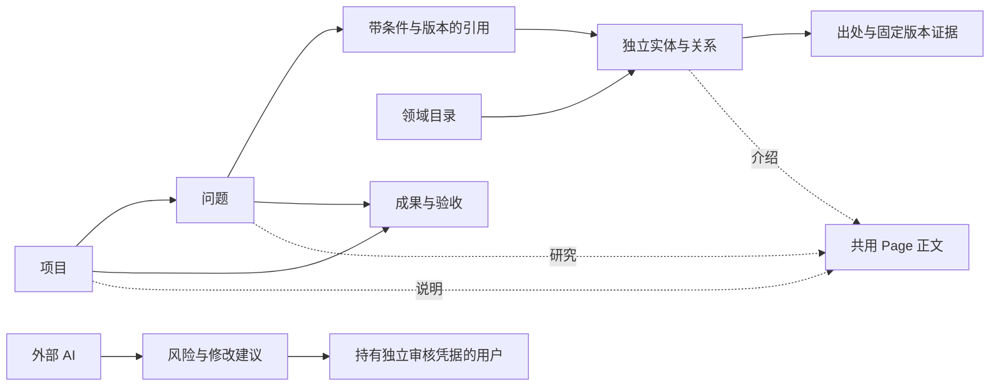

# 知识工作台：首版实施契约

源码新增 migration `021`、`echome.capabilities.v13` 和两个知识库 MCP 入口。本功能在隔离开发实例验证；生产部署与 npm 包发布分别进行，不能仅凭主分支代码判断运行实例已更新。原有记忆、卡片不会自动转换成结构化知识。

## 用户结构

`/knowledge` 提供两条主浏览路径，默认按项目：

- **项目**：项目卡片内展开问题 → 引用的知识；独立问题单独成组。项目详情也沿用同一层级展示。小项目默认展开，大项目按需分页加载。
- **领域**：领域 → 子领域 → 知识；“知识索引”仅显示概念、方法、工具和对象，保留尚未归入目录的内容入口。
- **文档与资料**：通过独立辅助入口管理，也在项目、问题、知识详情中按关联展示。文档与资料可以独立保存；Page 同时提供各对象的正文能力。

两条主线引用同一份独立知识。详情页优先显示问题、子领域或知识入口，随后展示正文；项目直接引用的知识与问题各自使用的知识明确区分。知识名称直接打开知识详情，使用时的版本、条件与结果通过“本次使用记录”查看。文档、资料详情可返回关联对象。当前浏览范围由 `?view=` 保留，详情通过 `?from=` 返回对应列表。

首页保留“项目 / 领域”主导航，移除重复的范围下拉，领域通过轻量链接进入知识索引。文档资料与核对入口为辅助操作；文档和资料使用按钮切换。领域表单固定领域类型；新知识默认概念，可选方法、工具或对象。

首页和详情顶部都有知识库全局搜索。`?view=search&q=` 保存关键词，`?category=` 保存结果类型，`?offset=` 保存分页，进入详情和返回时保留搜索状态。搜索覆盖名称、别名、介绍正文、已保存摘录等文本，返回项目、问题、领域、知识（实体与关系）、补充/独立文档、资料和成果；内部目录位置、引用记录和审核事件不混入结果。总览 Page 的正文命中归到所属对象，避免重复。名称精确/前缀命中优先，正文结果展示片段、类型与代表路径；多位置归属明确显示数量。此搜索是关键词发现，不是语义检索、完整事实查询，也不抓取外链全文。

知识详情将“所属领域”和“应用于问题与项目”并列展示为可点击路径，手机上纵向排列。目录与使用记录分别分页；使用记录保留固定版本，已归档问题和项目仍可追溯并标注状态。历史知识页明确说明关联图展示当前关系。正文、个人认知、资料和核对各有位置；版本记录与提出核对收在“更多”中。

领域目录按 placement 的父子关系展示树形列表，展开时分页加载子项，名称可进入详情；小目录默认展开两级，大目录按需展开。同一知识可显示在多个目录位置，仍引用同一实体。没有有效目录位置的领域单独列在“未归类领域”。搜索显示匹配项所在路径，缺失或停用的上级不伪装为根目录。未分类知识仍由“知识索引”访问；原有列表与目录搜索 URL 保持可用。

成果登记真实输出和验收。知识详情可以反向查看在哪里用过。`/knowledge/review` 逐张核对具体疑点，滑动只换卡，决定通过按钮确认。

### 首次使用与持续积累

- 空项目库提供“提出第一个问题”和“创建项目”入口；新项目可同时保存首个问题。可选字段收在“更多设置”，不要求先整理完整分类。
- 创建领域时同步建立目录位置，默认顶层；从领域内新建子领域或知识时自动带入当前位置。一个领域有多个位置时由用户选择。创建知识、分类和问题引用在一个事务内完成，失败全部回滚。
- “调整分类”展示所有收纳路径，可移动已有位置、添加另一个位置。移动子领域时保留下级分支；移除叶子知识的一个分类只归档该位置，不删除知识、正文和使用历史。
- 引用选择器按需查询，每页 20 条，支持名称搜索和继续加载；同名领域通过完整路径区分，不在打开表单时加载整库。编辑已有引用默认保留固定版本，升级到当前版本必须明确点击。
- 表单关闭、正文与个人认知离开页面时提醒未保存内容，刷新或关闭标签页使用浏览器提醒。提醒不等于自动保存草稿。
- 当前标签页保留项目与领域的展开状态；最近查看保留最近访问的记录 ID，首页最多显示四项并可清空。浏览偏好按账号与 API 地址隔离，存储中不复制知识正文。

Markdown 支持标题、列表、表格、代码、图片和链接；原始 HTML 不执行，渲染后经 DOMPurify 清理。私有附件经认证读取；外部 URL 和绝对路径可作引用，绝对路径不保证手机可打开。

## 物理映射与字段

完整必填项、默认值和枚举以 `hub/app/schemas/knowledge.py` 及认证后的 `GET /api/v1/knowledge/schema` 为准。首版共用身份、历史和引用机制，避免为每种逻辑对象复制修订代码；这不是新的用户业务层。

| 表 | 内容与约束 |
|---|---|
| knowledge_records | UUID、user_id、固定 kind、revision、status、严格类型化 payload、时间；仅 project 可带旧 Project 的 project_id |
| knowledge_versions | 完整快照、所属记录、版本号、实际凭据身份、原因、时间；版本唯一，API 只追加 |
| knowledge_references | 所属记录/版本、目标记录/类型/版本、字段位置；复合外键约束同用户和真实版本 |
| knowledge_overviews | 当前对象与总览 Page 的唯一绑定投影；历史在 Page 版本中 |
| knowledge_decisions | 提案版本、决定、理由、凭据身份和实际新版本；只追加 |
| knowledge_agent_tokens | 名称、用户、Token 摘要和撤销状态，不存明文 |
| knowledge_assets | 私有文件 ID、用户、文件名、类型、SHA-256、大小；磁盘路径由服务端 ID 决定 |

| kind | 最少字段 | 其他主要内容 |
|---|---|---|
| project | name | summary、status；复用旧 Project，研究项目使用 workspace |
| question | title | project_id 可空；resolved 需要回答或关闭原因 |
| entity | name | entity_kind、summary、aliases、attributes、personal_note；没有项目归属 |
| predicate | code、label | family、value_kind、description；既有 code、用途和值类型不能改写含义 |
| relation | subject_id、predicate_id、客体 | object_entity_id 与有类型的 object_value 二选一；statement_md、qualifiers、perspective、时间、evidence |
| page | title | body_md、bindings；overview/supplementary，允许独立文档和共享补充文档 |
| source | title | source_kind、origin_ref、context_ids、作者、时间、保留方式和实际摘录 |
| placement | entity_id | parent_id、sort_order；目录独立，可多处放置，防重复与环 |
| usage | context_id、knowledge_id、knowledge_revision | role、application_note，可固定知识 Page 和成果版本 |
| deliverable | title、resource_ref、项目或问题 | 预览、格式、复现 Page；同时填项目与问题时校验归属 |
| review | title、issue_kind、explanation、targets | targets 固定版本；proposal 为 none/update/merge/archive/verify |
| acceptance | deliverable_id、deliverable_revision | submitted 可由 AI 登记；accepted/rejected 需要审核凭据与固定的验收标准 Page |

Source 的一个版本对应不可覆盖的资料留存：reference 仅出处，excerpt 必要摘录，snapshot 实际文本，internal_version 固定已有 Page 版本。Relation evidence 固定 source_id/source_revision，保存 locator、quote、supports/refutes/context。引文匹配返回 matched/mismatch/unverified，匹配不代表结论为真。内部 Page 不重复保存全文。

## 并发、查询与上下文

- 修改提交完整 data 和 expected_revision，过期返回 409；当前状态、历史、引用同事务提交。按用户持有短 PostgreSQL advisory transaction lock，锁内不调用模型或抓取远程资料。
- Search 发现字段及直接关联 Page 正文中的候选，不作语义相似度或真实性判断。Query 枚举结构化筛选结果，返回 total、next_offset、complete、coverage；只承诺已存记录的授权查询范围。
- 分页为实时读取，跨页可能有变更；冻结业务快照和专用关系视图留给后续投影。未提炼的 Page 事实不在精确 Query 覆盖范围。
- 默认排除归档记录；关系查询解析合并前 ID，停用依赖不作为当前可复用关系。旧使用保留版本并显示当前变化警示。知识工具不缓存事实。
- context 提供项目/问题、知识、Page、递归证据、成果、验收和未决风险。默认正文预算 48,000 字符，单个长字段最多 8,000；omitted_fields 给出完整版本读取地址，条目上限通过 truncated 明示。

## 审核边界

普通 JWT / 应急 Token 是账号凭据，不能根据 `source=web` 或文字“人工确认”证明来自人。知识专用 AI Token 只访问知识库，可保存普通内容、实际输出和 review；其摘要保存在数据库，可撤销。

高影响动作需要独立 `ECHOME_KNOWLEDGE_REVIEW_KEY`。不要把此凭据配置给 AI；UI 确认时使用 `X-EchoMe-Review-Key`，不持久存入浏览器。AI 专用 Token 即使带该头也不能获得审核权。判断表示某凭据针对某版本做过判断，不证明自然人身份，也不保证绝对正确。

合并、修改已核对内容、停用被引用知识与正式验收会再次检查提案/目标版本，保留原 ID 和历史。新成果不继承旧验收。已有核对不能通过先制造争议再覆盖来绕过。

首版自动规则只提出同名同类型候选，以及单份实践支持通用结论的泛化风险。冲突、正文不一致和粒度问题由外部 AI 提交，不宣称部署了语义判断模型。按问题类型与目标版本去重；新依据应作为版本目标引用。补查只登记需要证据，仍由外部 AI 执行。

## API / MCP / 部署

以下路径均以 `/api/v1/knowledge` 开头：

| 方法与路径 | 用途 |
|---|---|
| GET /schema | 字段与权限能力 |
| GET / POST /records | 分页发现 / 创建 |
| POST /capture | 原子创建：record 为 project/question/entity；placement 为可选目录位置，context_id 为可选问题/项目引用，first_question 为可选首个问题 |
| POST /placements/{id}/remove | expected_revision 校验后归档叶子分类位置；下级检查与归档使用同一事务锁，不删除知识或修改旧 PATCH 的语义 |
| GET /choices | 按需选择引用：kinds 最多 4 种（placement 单独查询），search 按名称匹配，exclude_id/exclude_topics 排除不适用项，offset/limit 分页（上限 50），返回最少元数据及目录路径 |
| GET / PATCH /records/{id} | 当前或 ?revision=N / 带版本修改 |
| GET /records/{id}/history | 分页历史 |
| GET /records/{id}/backlinks | 当前反向引用 |
| GET /records/{id}/context | 有预算的上下文 |
| POST /query | 结构化查询，继续 next_offset |
| GET /directory | 分页目录：parent_id 展开下级，unplaced 查询未归类领域，search 返回领域及其路径 |
| GET /project-tree | 分页项目卡片 / parent_id 的问题与知识引用 / independent 独立问题 |
| GET /search | q 全局关键词，category 可选 all/projects/questions/domains/knowledge/pages/sources/deliverables；分类计数、片段、路径和分页 |
| GET /records/{id}/connections | section=domains 返回目录路径；section=uses 返回问题/项目与固定使用版本，均支持 offset/limit |
| POST / GET /reviews/{id}/decisions | 审核决定 / 审计记录 |
| POST / GET /agent-tokens | 发行 / 凭据元数据 |
| DELETE /agent-tokens/{id} | 撤销 AI 凭据 |
| POST /assets?filename=... | 文件字节上传，单文件 128 MiB 上限 |
| GET /assets/{id} | 同用户认证下载，禁止缓存和类型嗅探 |

`GET /records` 与 `POST /query` 可选 `exclude_entity_kind`（topic/concept/tool/method/object），只用于 kind=entity。筛选在数据库计数、分页和正文搜索前执行；不传时保留原有全实体查询行为。

MCP core 源码共 20 工具，新增 `echome_knowledge_read`（schema/list/query/get/history/backlinks/context）、`echome_knowledge_write`（create/update）。review 是提案，没有批准工具。可单独设置 `ECHOME_KNOWLEDGE_HUB_URL`、`ECHOME_KNOWLEDGE_TOKEN`；未设置时沿用 Hub 配置。旧记忆入口未被替换。

迁移 021 只新增表及约束。旧 Projects API 与知识工作台名称/摘要保持一致；有知识历史的项目不能硬删除。Compose 新增 `./data/knowledge-assets` bind mount；备份须包含 PostgreSQL 与附件目录。生产迁移、Hub/Web/MCP 更新和发布按当前部署授权执行。

真实验证脚本为 `scripts/knowledge_blender_probe.py` 和 `scripts/knowledge_case_acceptance.py`。后者仅接受隔离本机 Hub `http://127.0.0.1:20110`，经 MCP 保存记录，并在独立进程复用知识。鲸鱼娘技术体块已生成、渲染、重开；材质问题与修正保存为两版成果和文档。角色参考、外观、生产拓扑、绑定和动画仍待确认，不据此宣称角色交付通过。

开发预览另有“EchoMe 知识库构建与演进”真实案例：两个问题引用“问题驱动的知识组织 / 可追溯的知识复用 / 人机协作的知识核对”三个方法，收纳于“知识库 → 知识组织与复用”。其中“可追溯的知识复用”被两个问题共用。正文保留设计取舍、实际实现边界和待核对范围，来源固定到开发记录 Page，浏览器结果及截图登记为开发成果；不把自动检查等同于人工知识审核或生产发布。

完整网状图交互、业务专用投影、语义候选、抽样核对及更自然的审核认证方式属于后续迭代。
